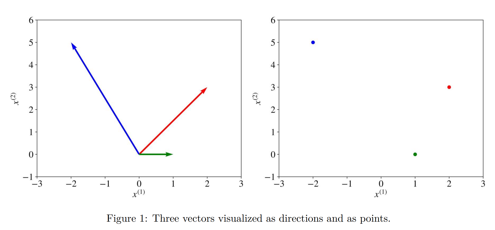

# 引言

## 1.1什么是机器学习

机器学习是计算机科学的一个子领域，它关注的是建立一种依赖于一些现象的例子集合的算法。这些例子可以来自大自然，人类手工制作，或其他算法生成。

机器学习也可以定义为通过解决以下两类实际问题的过程：&#x20;

1\)收集数据集

2\)基于该数据集用算法构建解决实际问题的统计模型。

为了节省输入文字，本文将交替使用“学习（Learning）”和“机器学习（machine Learning）”。

## 1.2 学习的种类

学习可以分为监督学习（supervised Learning）、半监督学习（semi-supervised Learning）、无监督学习（unsupervised learning）和强化学习(reinforcement learning)。

### 1.2.1 监督学习

在监督学习中，**数据集（dataset）**是**带标签样本（labeled examples）**$$\{(x_i, y_i) \}^N_{i=1}$$的集合。$$N$$中每一个元素$${x}_i$$称为一个**特征向量（feature vector）**。一个特征向量在每个维度$$j = 1,...,D$$ 中包含一个以某种方式描述例子的值。这个以$$x ^{(j)}$$表示的值叫特征（**feature**）。例如，如果集合中的每个例子$$x$$代表一个人，那么第一个特征$$x ^{(1)}$$可以看作身高(cm)，第二个特征$$x ^{(2)}$$可以看作体重(kg)， $$x ^{(3)}$$可以看作性别，以此类推。对于数据集中的所有例子，特征向量中位置$$j$$处的特征总是描述相同的一类信息。意思是，如果$$x ^{(2)}_i$$在某些例子$$x _i$$中包含重量单位为kg，那么$$x ^{(2)}_k$$也将在每个例子$$x_k，k = 1，…N$$中的重量单位为kg。**标签**$$y_i$$可以是一个属于一个有限集合的类{1,2，…， C}的元素，实数，或更复杂的结构，如向量、矩阵、树或图。除非另有说明，本书中的$$y_i$$要么是一个有限类集，要么是一个实数。可以将类视为属于某个样本的类别。例如，样本是电子邮件消息，而问题是垃圾邮件检测，那么就有两个类{垃圾邮件，不是垃圾邮件}（$$\{spam, not \_ spam\}$$）。

**监督学习算法（algorithm）**的目标是使用数据集生成一个**模型**（**model）**，这个模型将特征向量$$x$$作为输入，将通过这个特征向量推导出的标签作为输出。例如，将人的数据集创建的模型可以将描述一个人的特征向量作为输入，并将这个人患癌症的概率作为输出。

\*输出可以表示{患有癌症，没患癌症}

### 1.2.2 无监督学习

在**无监督学习**中，数据集是一个**不带标签的样本**$$\{ x_i \} ^N _{i=1}$$的集合。同样，$$x$$是一个特征向量，而非监督学习算法的目标是创建一个将一个特征向量$$x$$作为输入，并将其转换为另一个向量或一个可用于解决实际问题的值的模型。例如，在**聚类（clustering）**问题中，模型为数据集中的每个特征向量返回集群的id。在**降维（dimensionality reduction）问题中**，模型的输出是一个特征数量少于输入$$x$$的特征向量;在**离群点检测（outlier detection）问题**中，输出是一个表示$$x$$与数据集中典型示例的差异程度的实数。

\*聚类：下图中坐标轴的点通过聚类算法，可以得到右边图划分3类的结果。

 (1).png>)

\*降维：

\*离群点检测：

.png>)

### 1.2.3 半监督学习

在**半监督学习**中，数据集包含带标签和不带标记的样本。通常情况下，未标记样本的数量要比标记样本的数量多得多。**半监督学习**算法的目标与监督学习算法的目标相同。期望的是使用很多未标记的样本可以帮助学习算法找到(我们可能会说产生或计算)一个更好的模型。添加更多不带标签的样本可以使学习受益，看起来可能与直觉相反。似乎是在给问题增加了更多的不确定性。然而，当增加不带标签样本的时候，就增加了关于这个问题的更多信息:一个更大的样本可以更好地反映带标签数据来自的概率分布。理论上，学习算法应该能够充分利用这些额外的信息。

### 1.2.4 强化学习

**强化学习**是机器学习的一个子领域，机器“生活”在一个环境中，能够将该环境的状态感知为特征向量。机器可以在每种状态下执行操作。不同的行动会带来不同的奖励，也会将机器切换到环境的另一种状态。强化学习算法的目标是**学习策略（policy）**。

策略是一种函数(类似于监督学习中的模型)，它以状态的特征向量作为输入，并以在该状态下执行的最优动作作为输出。如果期望平均奖励最大化，行动就是最优的。

强化学习解决了一种决策是连续的，目标是长期的特殊的问题，比如游戏、机器人、资源管理或物流。本书强调了（one-shot decision），即输入示例相互独立，以及过去所做的预测。强化学习不在本书的讨论范围之内。

## 1.3 监督学习是如何工作的？

在本节中，将简要地解释监督学习是如何工作的，以在详细讨论之前对整个过程有一个大致的了解。接下来将会使用实践中使用最频繁的机器学习类型--监督学习作为例子。

监督学习过程从收集数据开始。监督学习的数据是一对**输入，输出(input, output)**的集合。input可以是任何东西，例如电子邮件消息、图片或传感器测量值。输出通常是实数或标签(例如:spam、not\_spam、cat、dog、mouse等)。在某些情况下，输出是向量(例如，图片上围绕一个人的矩形的四个坐标)、序列(例如输入大而漂亮的汽车的\[形容词、形容词、名词])或其他结构

假设要使用监督学习解决的问题是垃圾邮件检测。收集数据例如是10,000封电子邮件，每封邮件都有一个标签，要么是垃圾邮件，要么不是垃圾邮件(可以自己手动添加这些标签，或者花钱情人添加这些标签)。现在，必须将每个电子邮件消息转换为一个特征向量。

数据分析师根据他们的经验，决定如何将真实世界的实体(如电子邮件消息)转换为特征向量。将文本转换为特征向量称为**词袋（bag of words)**的一种常见方法是取一个英语单词词典(假设它包含20,000个按字母顺序排序的单词)，并规定在我们的特征向量中：

·如果电子邮件消息包含单词“a”，则第一个特征等于1;否则，这个特征为0

·如果电子邮件信息包含单词“Aaron”，则第二个特征值等于1;否则，这个特征等于0

·...

·如果电子邮件信息包含单词“zulu”，则第20000个的特征值等于1;否则，这个特征等于0。

对集合中的每个电子邮件消息重复上述过程，从而得到10,000个特征向量(每个向量的维数为20,000)和一个标签(垃圾邮件/ 不是垃圾邮件)。

现在有了机器可读的输入数据，但输出标签仍然是人类可读的文本形式。有些学习算法需要将标签转换为数字。例如，一些算法需要像0(表示标签“不是垃圾邮件”)和1(表示标签“垃圾邮件”)这样的数字。以下用来说明监督学习的算法称为支持向量机(SVM)，这个算法要求正标签(在本例中为“垃圾邮件”)的数值为+1(one)，而负标签("不是垃圾邮件")的值为-1(minus one)。

现在，已经有了一个数据集和一个学习算法，因此已经准备好将学习算法应用到数据集以获得模型。

SVM将每个特征向量视为高维空间中的一个点(在我们的例子中，空间是20000维)。该算法将所有特征向量放在一个虚拟的20000维图上，并绘制一条虚拟的19999维线(超平面)，该线将带有正标签的示例与带有负标签的示例分隔开来。在机器学习中，将不同类别的例子分开的边界称为**决策边界（decision boundary）**。

超平面的方程是由两个参数给出的，一个是与输入特征向量x相同维数的实值向量$$w$$，另一个是像这样的实数向量$$b$$：

$$
wx-b=0
$$

其中表达式$$wx$$表示$$w^{(1)}x^{(1)}+w^{(2)}x^{(2)}+...w^{(D)}x^{(D)},$$， D是特征向量x的维数。

(如果有些方程你现在还不清楚，在第2章中，我们会回顾理解它们所必需的数学和统计概念。现在，试着对这里发生的事情有一个直观的认识。当你读完下一章后，一切都会变得更清楚。)

输入特征向量x的预测标签是这样给出的：

$$
y = sign(wx − b),
$$

sign是一个数学运算符，它接受任何值作为输入，如果输入是正数返回+1，如果输入是负数返回-1。

在这种情况下，学习算法SVM的目标是利用数据集，找到参数w和b的最优值w\*和b\*。一旦学习算法确定了这些最优值，然后将模型f(x)定义为

$$
f(x) = sign(w^*x-b^*)
$$

因此，要使用SVM模型预测一封电子邮件是否为垃圾邮件，您必须提取邮件的文本，将其转换为一个特征向量，然后将这个向量乘以w\*，减去b\*，并对结果进行sign运算。这将给出我们的预测(+1表示"垃圾邮件"，-1表示"不是垃圾邮件")。

机器是怎么找到w\*和b\*的?它解决了一个优化问题。机器擅长在约束条件下优化函数。

那么我们需要满足哪些约束条件呢?首先，我们希望这个模型能正确预测10000个样本的标签。记住，每个例子i = 1，…， 10000由一对(xi, yi)给出，其中xi是样本i的特征向量，yi是它的标签，值为-1或+1。所以约束条件自然是：

.png>)

$$
wx_i-b\geq+1\space if \space y_i =+1,
$$

$$
wx_i-b\leq-1\space if \space y_i =+1,
$$

我们也希望超平面能最大限度地将正例子与负例子分开。边界是两个类最接近的例子之间的距离，由决策边界定义。较大的偏差有助于更好的泛化，也就是模型在未来如何对新例子进行分类。为此，我们需要最小化w的欧几里德范数||w||，并由$$\sqrt{\sum{^D_{j=1}(w^{(j)})^2}}$$给出.

我们想让机器解决的优化问题是这样的:

当i = 1,...,N ，最小化||w||服从$$y_i(wx_i-b) \geq 1$$. 表达式$$y_i(wx_i-b) \geq 1$$就是上述两个约束条件的一种紧凑形式。

这个优化问题的解决方案，由w和b给出，称为统计模型，或者简单地说，模型。而建立模型的过程称为训练。

对于二维特征向量，问题和解决方法可以可视化地如图1所示。蓝色圆圈和橙色圆圈分别代表正例和反例，wx-b = 0给出的直线为决策边界。

为什么通过最小化w的范数，我们能找到两个类之间的最大差值?几何上，方程wx-b = 1和wx-b = -1定义了两个平行超平面，如图1所示。这些超平面之间的距离是$$\frac{2}{||w||}$$，所以范数||w||越小，这两个超平面之间的距离越大。

这就是支持向量机的工作原理。这个算法的特殊版本构建了所谓的线性模型。之所以称为线性是因为判定边界是直线(或平面、超平面)。支持向量机还可以加入核函数，使决策边界任意非线性。在某些情况下，由于数据中的噪声、标记错误或异常值(这些示例与数据集中的典型示例非常不同)，完全分离这两组点是不可能的。SVM的另一个版本还可以加入惩罚超参数(hyperparameter\*)，用于对特定类的训练示例进行错误分类。我们将在第三章对支持向量机算法进行更详细的研究。

在这一点上，您应该保留以下内容:任何隐式或显式构建模型的分类学习算法都创建了一个决策边界。判定边界可以是直线的，也可以是曲线的，也可以是复杂的形式，也可以是一些几何图形的叠加。决策边界的形式决定了模型的准确性(即标签被正确预测的例子的比例)。决策边界的形式，基于训练数据的算法或数学计算方式，将一种学习算法与另一种区分开来。

在实践中，学习算法还有另外两个基本的区分因素需要考虑:模型建立的速度和预测处理时间。在许多实际情况下，您可能更喜欢快速构建不那么精确的模型的学习算法。此外，您可能更喜欢不那么准确的模型，因为它可以更快地进行预测。

\*hyperparameter超参数是学习算法的属性，通常(但不总是)具有数值。这个值会影响算法的工作方式。这些值不是由算法本身从数据中学习的。它们必须由数据分析师在运行算法之前设置。

## 1.4为什么模型对新数据有效

为什么一个机器学习的模型能够正确地预测新的以前从未见过的例子的标签?要理解这一点，请查看图1中的图。如果两个类通过决策边界可相互分离，那么，显然，属于每个类的例子位于决策边界创建的两个不同的子空间中。

如果用于训练的例子是随机选择的，彼此独立，遵循相同的程序，那么，从统计学上来说，新的负例更有可能位于离其他反面例子不远的地方。新的正例也是如此:它可能来自于周围的其他正例。在这种情况下，我们的决策边界仍然很有可能将新的正例和负例彼此分开。对于其他可能性较小的情况，我们的模型会出错，但因为这种情况的可能性较小，错误的数量可能会比正确预测的数量更少。

直观地说，训练样本集越大，新样本就越不可能与用于训练的样本不同(并且位于离示例很远的地方)

为了使新样本出错的概率最小化，SVM算法通过寻找最大的边界，明确地尝试以尽可能远离这两类例子的方式绘制决策边界。

读者感兴趣的易学性和理解之间的密切关系模型误差,训练集的大小,数学方程,定义了模型的形式,和所花费的时间来构建模型是鼓励阅读PAC学习。PAC(概率近似正确)学习理论有助于分析学习算法是否以及在什么条件下可能输出一个近似正确的分类器。
